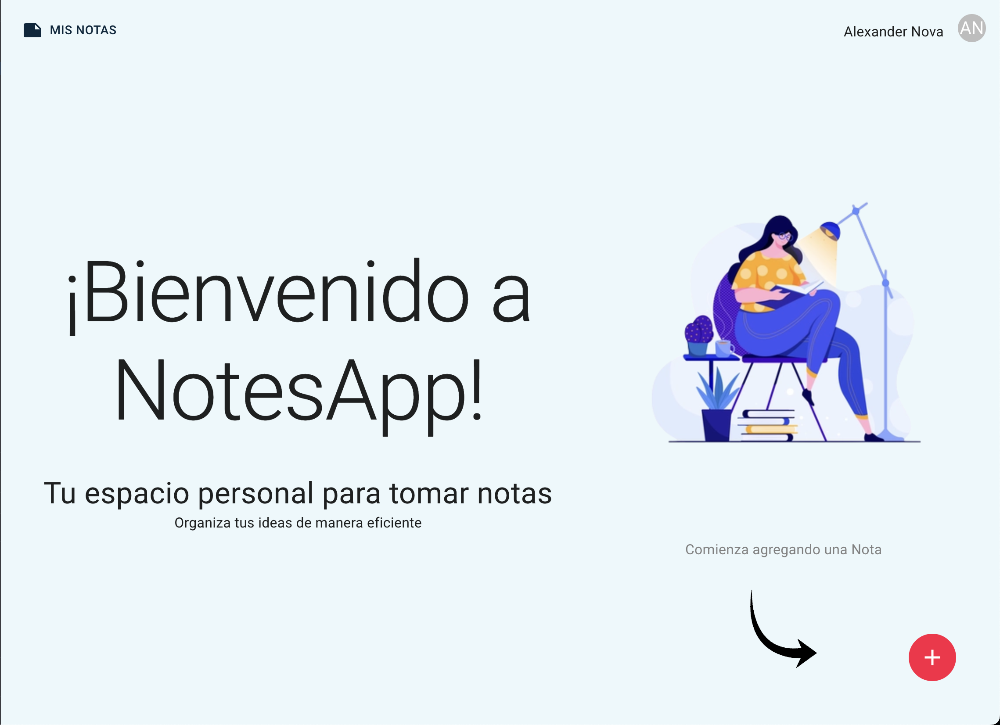

# 📝 NotesApp - React & Firebase Notes Application



[](https://reactjs.org/)
[](https://redux-toolkit.js.org/)
[](https://firebase.google.com/)
[](https://mui.com/)
[](https://vitejs.dev/)
[](https://developer.mozilla.org/en-US/docs/Web/JavaScript)
[](https://sass-lang.com/)
[](https://jestjs.io/)
[](https://eslint.org/)
[](https://prettier.io/)
[](https://cloudinary.com/)
[](https://reactrouter.com/)
[](https://sweetalert2.github.io/)
[](https://date-fns.org/)

## 📋 General Description

**NotesApp** is a modern and comprehensive web application for personal note management, developed with React 18 and Firebase. The application allows users to create, edit, delete, and organize their notes with image support, secure authentication, and an intuitive user interface.

## ✨ Main Features

### 🔐 Authentication & Security
- **Firebase Auth Authentication**: Login with email/password and Google OAuth
- **Session Management**: Authentication persistence with `onAuthStateChanged`
- **Route Protection**: Protected routes system based on authentication status
- **User Profile**: Personal information and profile picture management

### 📝 Note Management
- **Complete CRUD**: Create, read, update, and delete notes
- **Real-time Editor**: Automatic saving of changes
- **Multimedia Support**: Image upload and visualization (Cloudinary)
- **Search & Filtering**: Efficient navigation between notes
- **Responsive Interface**: Adaptive design for all devices

### 🎨 User Interface
- **Material-UI**: Modern and accessible components
- **Custom Theme**: Purple/blue color palette
- **Animations**: Smooth transitions and visual feedback
- **Navigation Sidebar**: Quick access to all notes
- **Image Gallery**: Grid visualization of attached images

### 🔧 Technical Features
- **Global State with Redux Toolkit**: Efficient application state management
- **Firebase Firestore**: Real-time NoSQL database
- **Cloudinary**: Image storage and optimization
- **Form Validation**: Robust validation system
- **Error Handling**: Clear user feedback

## 🏗️ Project Architecture

### Folder Structure (Atomic Design)

```
src/
├── atomic/                    # Components following Atomic Design
│   ├── atoms/                # Basic components (Button, TextField, etc.)
│   ├── molecules/            # Compound components (NavBar, ImageGallery, etc.)
│   ├── organisms/            # Complex components (Notes, NoteView, etc.)
│   ├── templates/            # Layouts and page structures
│   └── pages/                # Main application pages
├── store/                    # Global state with Redux Toolkit
│   ├── auth/                 # Slice and thunks for authentication
│   └── journal/              # Slice and thunks for note management
├── firebase/                 # Firebase configuration and providers
├── hooks/                    # Reusable custom hooks
├── helpers/                  # Utility functions
├── theme/                    # Material-UI theme configuration
└── assets/                   # Static resources
```

### Technologies & Libraries

#### Frontend Core
- **React 18.2.0**: Main library for user interface
- **React Router DOM 7.6.2**: Routing and navigation
- **Vite 3.0.0**: Build tool and development server

#### State & Data Management
- **Redux Toolkit 1.8.3**: Global state and data management
- **React Redux 8.0.2**: Redux integration with React

#### UI/UX
- **Material-UI 5.9.2**: Component system
- **Material Icons**: Consistent iconography
- **Emotion**: CSS-in-JS styling
- **Sass**: CSS preprocessor

#### Backend & Services
- **Firebase 10.7.1**: Authentication and database
- **Cloudinary**: Image storage
- **date-fns 2.30.0**: Date manipulation

#### Utilities
- **SweetAlert2**: Notifications and modals
- **Devicon**: Technology icons

#### Testing & Quality
- **Jest**: Testing framework
- **React Testing Library**: Component testing
- **ESLint**: Code linting
- **Prettier**: Code formatting

## 🚀 Installation & Configuration

### Prerequisites
- Node.js (version specified in `.nvmrc`)
- Yarn or npm
- Firebase account
- Cloudinary account (optional, for image uploads)

### Installation Steps

1. **Clone the repository**
   ```bash
   git clone <repository-url>
   cd notesapp-react
   ```

2. **Install dependencies**
   ```bash
   yarn install
   # or
   npm install
   ```

3. **Configure environment variables**
   
   Create `.env` file in the project root:
   ```env
   # Firebase Configuration
   VITE_FIREBASE_API_KEY=your_api_key
   VITE_FIREBASE_AUTH_DOMAIN=your_project.firebaseapp.com
   VITE_FIREBASE_PROJECT_ID=your_project_id
   VITE_FIREBASE_STORAGE_BUCKET=your_project.appspot.com
   VITE_FIREBASE_MESSAGING_SENDER_ID=your_sender_id
   VITE_FIREBASE_APP_ID=your_app_id
   VITE_FIREBASE_MEASUREMENT_ID=your_measurement_id

   # Cloudinary Configuration (optional)
   VITE_CLOUDINARY_URL=https://api.cloudinary.com/v1_1/your_cloud_name/upload
   ```

4. **Configure Firebase**
   - Create project in [Firebase Console](https://console.firebase.google.com/)
   - Enable Authentication (Email/Password and Google)
   - Enable Firestore Database
   - Configure Firestore security rules

5. **Run in development**
   ```bash
   yarn dev
   # or
   npm run dev
   ```

6. **Open in browser**
   ```
   http://localhost:5173
   ```

## 📱 Detailed Features

### Authentication System
- **Credential Login**: Email and password
- **Google Login**: Integrated OAuth 2.0
- **User Registration**: New account creation
- **Session Persistence**: Keeps user logged in
- **Secure Logout**: State cleanup and redirection

### Note Management
- **Create Note**: Form with title and content
- **Edit Note**: Real-time editor with auto-save
- **Delete Note**: Confirmation before deletion
- **Upload Images**: Support for multiple formats (JPG, PNG, GIF, WebP)
- **Image Preview**: Grid gallery of images
- **Search**: Filter by title and content

### User Interface
- **Main Dashboard**: View all notes in cards
- **Note Editor**: Clean and functional interface
- **Navigation Sidebar**: Quick access to notes
- **Responsive Design**: Adaptable to mobiles and tablets
- **Dark/Light Theme**: Preference configuration

## 🔧 Available Scripts

```bash
# Development
yarn dev          # Start development server
yarn build        # Build for production
yarn preview      # Preview production build

# Testing
yarn test         # Run tests with Jest
```

## 🧪 Testing

The application includes a comprehensive test suite:

- **Unit tests**: Individual components
- **Integration tests**: User flows
- **E2E tests**: Complete use cases

```bash
yarn test                 # Run all tests
yarn test --watch        # Watch mode
yarn test --coverage     # With coverage report
```

## 📊 Application State

### Auth Slice
```javascript
{
  status: 'checking' | 'authenticated' | 'not-authenticated',
  uid: string | null,
  email: string | null,
  displayName: string | null,
  photoURL: string | null,
  errorMessage: string | null
}
```

### Journal Slice
```javascript
{
  isSaving: boolean,
  isLoading: boolean,
  messageSaved: string,
  notes: Note[],
  active: Note | null
}
```

## 🔒 Security

- **Environment Variables**: Sensitive configuration in `.env`
- **File Validation**: Allowed types and sizes
- **Firestore Rules**: User-controlled access
- **Robust Authentication**: Multiple login methods

## 🚀 Deployment

### Firebase Hosting
```bash
# Install Firebase CLI
npm install -g firebase-tools

# Login and configuration
firebase login
firebase init hosting

# Deploy
yarn build
firebase deploy
```

### Vercel
```bash
# Install Vercel CLI
npm i -g vercel

# Deploy
vercel
```

## 🤝 Contributing

1. **Fork** the repository
2. **Create** a feature branch (`git checkout -b feature/AmazingFeature`)
3. **Commit** your changes (`git commit -m 'Add some AmazingFeature'`)
4. **Push** to the branch (`git push origin feature/AmazingFeature`)
5. **Open** a Pull Request

### Contribution Guidelines
- Follow Atomic Design pattern for new components
- Maintain consistency in file naming
- Add tests for new features
- Document important changes

## 📝 License

This project is licensed under the MIT License. See the `LICENSE` file for more details.

## 👨‍💻 Author

**Developed with ❤️** - A technical skills demonstration application in React, Redux, and Firebase.

## 🙏 Acknowledgments

- **Firebase** for backend infrastructure
- **Material-UI** for UI components
- **Cloudinary** for image storage
- **React Testing Library** for testing tools

---

**Note**: This is a demonstration application. For production use, make sure to properly configure environment variables and Firebase security rules.